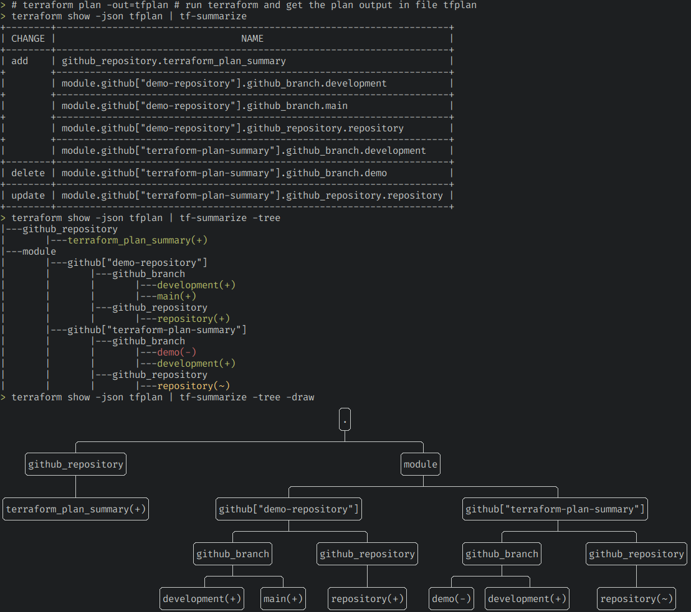

## tf-summarize (Terraform Summarizer)

[](https://github.com/dineshba/terraform-plan-summary/actions/workflows/build.yml)
[](https://github.com/dineshba/terraform-plan-summary/actions/workflows/release.yml)

[](https://github.com/dineshba/tf-summarize/blob/main/LICENSE)

`tf-summarize` is a command-line utility to print the summary of the terraform plan

- [tf-summarize (Terraform Summarizer)](#tf-summarize-terraform-summarizer)
  - [Demo](#demo)
  - [Why do we need it ?](#why-do-we-need-it-)
  - [Install](#install)
    - [Using Go](#using-go)
    - [Using Brew](#using-brew)
    - [Using asdf](#using-asdf)
    - [Using Docker](#using-docker)
    - [Download zip in release page](#download-zip-in-release-page)
    - [Clone and Build Binary](#clone-and-build-binary)
  - [Usage](#usage)
  - [Examples](#examples)
    - [Github Actions Workflow](#github-actions-workflow)
    - [Comment terraform plan summary in PRs](#comment-terraform-plan-summary-in-prs)
    - [Interactive summary review](#interactive-summary-review)
  - [Screenshot](#screenshot)
  - [TODO](#todo)

### Demo


If demo is slower for you, please see [examples](#examples) and [screenshot](#screenshot) for more details

### Why do we need it ?

- Most of the time, we make changes to the terraform files or tf-var files and run the plan command. And we precisely know which resources will get affected. In those time, we would like to just see the resource name and it's change.
- When our plan have more than say 10 changes, we will first see what are the deleted changes, or we will just see the list of resources that get affected.

### Install

#### Using Go
```sh
go install github.com/dineshba/tf-summarize@latest
```

#### Using Brew
```sh
brew tap thecasualcoder/stable
brew install tf-summarize
```

#### Using asdf
```sh
asdf plugin add tf-summarize
asdf install tf-summarize latest
```

> See the asdf [plugin source](https://github.com/adamcrews/asdf-tf-summarize#install) for more information.

#### Using Docker
```sh
docker run -v $PWD:/workspace -w /workspace ghcr.io/dineshba/tf-summarize -v # prints version
docker run -v $PWD:/workspace -w /workspace ghcr.io/dineshba/tf-summarize tfplan.json
docker run -v $PWD:/workspace -w /workspace ghcr.io/dineshba/tf-summarize -tree tfplan.json
# see example section for more examples


# add alias if needed
alias tf-summarize="docker run -v $PWD:/workspace -w /workspace ghcr.io/dineshba/tf-summarize"
tf-summarize tfplan.json
# see example section for more examples
```

> tf-summarize will accept tfplan directly. Docker based tf-summarize is not having terraform-binary to convert tfplan to json. So it only works with json files.
> If you want to use with tfplan directly, You can build a base image with terraform (use same version as tfplan created) and have our binary in it.

#### Download zip in release page
1. Go to release page [https://github.com/dineshba/terraform-plan-summary/releases](https://github.com/dineshba/terraform-plan-summary/releases)
2. Download the zip for your OS and unzip it
3. Copy it to local bin using `cp tf-summarize /usr/local/bin/tf-summarize` or to location which is part of `$PATH`
4. (For Mac Only) Give access to run if prompted. [Refer here](https://stackoverflow.com/a/19551359/5305962)

#### Clone and Build Binary
1. Clone this repo
2. Build binary using `make build` or `go build -o tf-summarize .`
3. Install it to local bin using `make install` or `cp tf-summarize /usr/local/bin/tf-summarize`

### Usage

```sh
$ tf-summarize -h

Usage of tf-summarize [args] [tf-plan.json|tfplan]

  -draw
        [Optional, used only with -tree or -separate-tree] draw trees instead of plain tree
  -out string
        [Optional] write output to file
  -separate-tree
        [Optional] print changes in tree format for each add/delete/change/recreate changes
  -tree
        [Optional] print changes in tree format
  -v    print version
```

### Examples

```sh
# run terraform plan command
terraform plan -out=tfplan

# provide plan itself directly
tf-summarize tfplan                           # summary in table format
tf-summarize -tree tfplan                     # summary in tree format
tf-summarize -tree -draw tfplan               # summary in 2D tree format
tf-summarize -json tfplan                     # summary in json format
tf-summarize -separate-tree tfplan            # summary in separate tree format
tf-summarize -separate-tree -draw tfplan      # summary in separate 2D tree format
tf-summarize -out=summary.md tfplan           # summary in output file instead of stdout

# provide json output from plan
terraform show -json tfplan | tf-summarize    # summary in table format
terraform show -json tfplan > output.json
tf-summarize output.json                      # summary in table format
```

#### Github Actions Workflow

Please refer this sample [github actions file](.github/workflows/demo.yml) and the sample runs [here](https://github.com/dineshba/tf-summarize/actions/workflows/demo.yml)

> Note: If you are using `hashicorp/setup-terraform` github action to setup terraform, ensure terraform_wrapper is set to false.

#### Comment terraform plan summary in PRs

Refer [this example](https://github.com/dineshba/tf-summarize/blob/demo-pr/.github/workflows/demo.yml#L61-L73) to add comments in your PR. Sample [comment](https://github.com/dineshba/tf-summarize/pull/19#issuecomment-1295882938) added by github actions bot.

#### Interactive summary review

You can use tool [fx](https://github.com/antonmedv/fx) to review the summary fo the terraform change
```sh
tf-summarize -json tfplan | fx
```

### Screenshot


### TODO

- [x] Read terraform state file directly. (Currently need to convert to json and pass it)
- [ ] Directly run the terraform plan and show the summary
- [ ] Able to show summary of the current terraform state
- [x] Include version subcommand in binary
